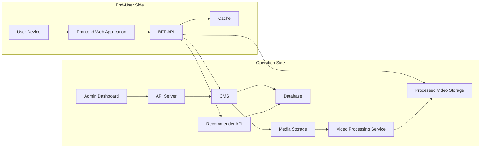

# System Architecture

This document provides an overview of the system architecture for the Minna No Hologram platform, a web-based video sharing website. The architecture is divided into two main parts:
- The End-User Side
- The Operation Side

## 1. End-User Side

- **Web Browser (User Device):**  
  Users access the platform using a web browser on their computer, tablet, or smartphone.

- **Frontend Web Application:**  
  The website interface allows users to:
  - Browse and search for hologram videos and DIY articles
  - Watch videos and read articles
  - Favorite content (like)

- **BFF API (Backend For Frontend):**  
  Serves as the main API for the frontend, aggregating data from:
  - Cache (for performance)
  - Processed Video Storage (for streaming)
  - CMS (for content metadata)
  - Recommender API (for personalized content)

- **Cache:**  
  Stores frequently accessed data to improve performance and reduce database load.

## 2. Operation Side

- **Admin Dashboard:**  
  Used by operators or administrators to:
  - Manage video and article content (upload, edit, delete)
  - Moderate user submissions and comments
  - View analytics and reports

- **API Server:**  
  Handles requests from the Admin Dashboard and communicates with the CMS.

- **CMS (Content Management System):**  
  Central system for managing all content:
  - Controls access to the Media Storage
  - Stores and retrieves metadata in the Database
  - Manages content lifecycles

- **Database (PostgreSQL):**  
  Stores structured data including:
  - User data and preferences
  - Video and article metadata
  - Platform settings and configurations

- **Media Storage:**  
  Stores original/raw video files and images uploaded by administrators.

- **Video Processing Service:**  
  Processes raw videos from Media Storage:
  - Converts videos into multiple qualities for different devices and connections
  - Optimizes content for streaming
  - Operates dynamically based on new uploads

- **Processed Video Storage:**  
  Stores the processed video files that are ready for end-user streaming.

- **Recommender API:**  
  Analyzes user behavior and content metadata to provide personalized recommendations:
  - Accesses the Database to retrieve user preferences and behavior
  - Generates personalized content recommendations

## System Architecture Diagram

## Data Flow

1. **Content Creation and Processing:**
   - Administrators upload raw videos through the Admin Dashboard
   - Videos are stored in Media Storage
   - Video Processing Service automatically processes videos into multiple formats
   - Processed videos are stored in Processed Video Storage

2. **User Content Consumption:**
   - Users access the Frontend Web Application
   - BFF API retrieves content based on user requests
   - Content is served from Cache when available
   - Video content is streamed from Processed Video Storage
   - Metadata and article content comes from CMS
   - Personalized recommendations are provided by Recommender API

3. **System Integration:**
   - CMS acts as the central hub for content management
   - Database stores all structured data
   - Cache improves performance for frequently accessed content
   - All components work together to provide a seamless user experience

This architecture ensures high performance, scalability, and a smooth user experience for both end-users and administrators of the Minna No Hologram platform.