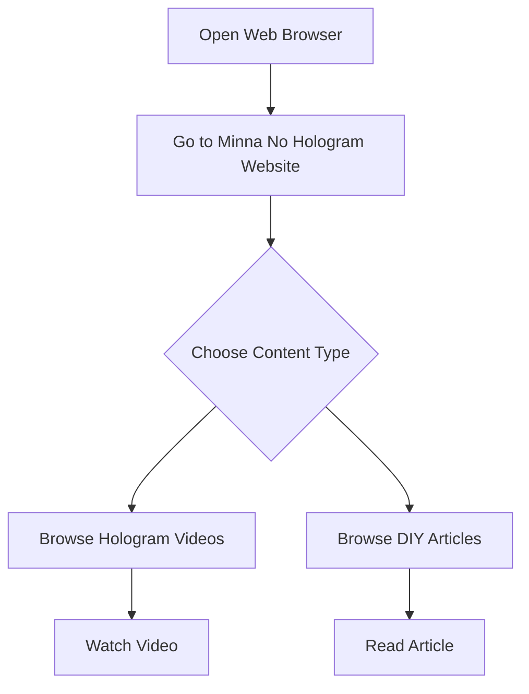

# User Flow Diagram

This diagram illustrates the typical steps a user takes to enjoy content on the Minna No Hologram platform.

**Description:**
- Users open a browser and visit the website.
- They choose to browse either Hologram Videos or DIY Articles.
- Users can then watch a video or read an article.